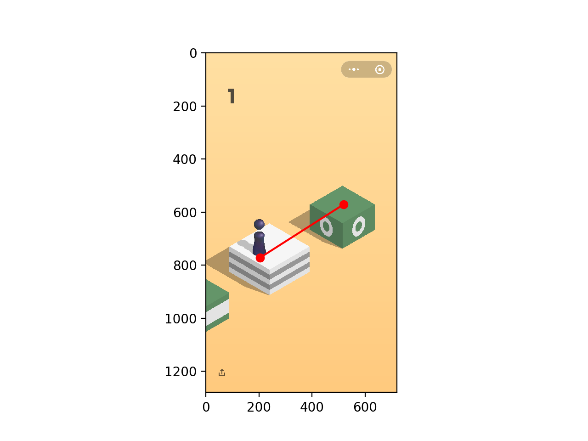

# Mannual Wechat Game Jump
微信小游戏“跳一跳”非常火，我大概是1月7日第一次玩，虐心程度非常高。不过因为游戏的操作性比较简单，所以很适合用代码来作为辅助。

## 思路
游戏的玩法是比较简单的，基本上就是玩家触碰屏幕，一段时间内松开，屏幕内的棋子就因此可以跳出一段距离，距离的长短由玩家触碰屏幕的持续时间决定。玩了几次以后发现，基本上是呈现的线性的关系。也就是说刷高分的关键就在于准确把握触碰屏幕的持续时间（当然这个对大部分人类来说难以掌握），而获得时间的关键就在于把握距离以及时间与距离的相关系数。
所以思路就比较直了：

1. 利用手机游戏界面截图手动测算距离。
2. 根据相应的时间与距离的换算系数计算出时间
3. 通过计算机向手机发送触屏的请求。

鄙人是数学系出身，如果按照我会的那些python知识，步骤2非常轻松，取点画图就行，但是在这里的步骤1和步骤3是真的毫无头绪。借鉴了别人的思路之后（https://github.com/faceair/youjumpijump）才知道了有ADB这个玩意儿。时间有限我就写了个手动版的没有时间再额外去搞图像识别。

## 用法
### Android手机
手机最好已获得root权限，因为截图要先存储在手机本地，无权限的话没法对文件进行修改。
### MacBook
我的个人电脑是Mac，linux应该差不多，Windows没研究过。
### 操作步骤
1. 手机连接电脑，切换到跳一跳游戏界面。 
2. 运行WechatJump.py（注意根据自己需要修改class中的img_dir也就是截图保存的本地路径），不出意外会打开一个matplotlib的图表界面。
3. 鼠标手动选择起点与终点。
4. 执行fun2().
5. 鼠标选择下一步的起点与终点.
6. 执行fun2().

### 结果
点了那么多下我也是够无聊的。。。而且这2000+的分还被微信给清了。。

